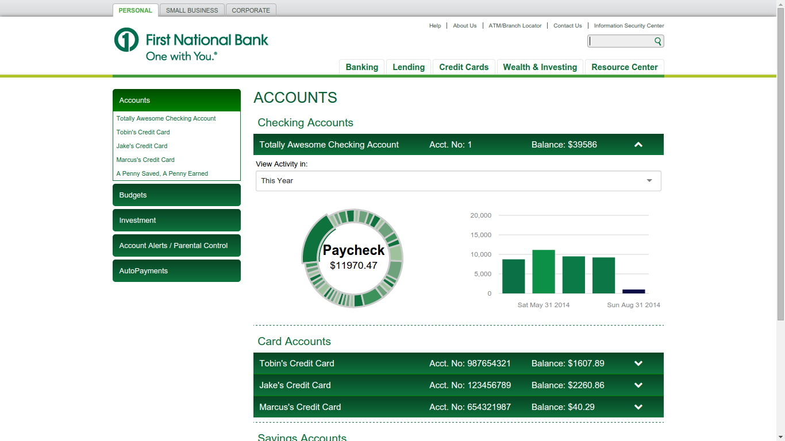
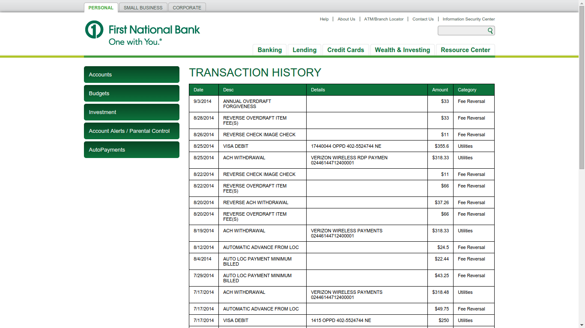
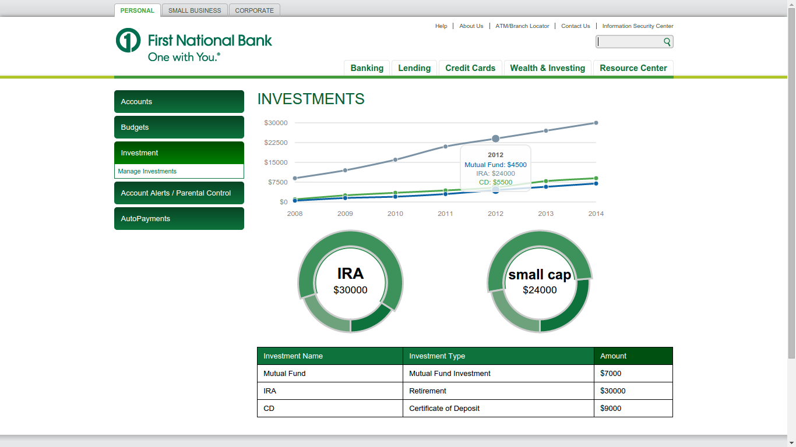
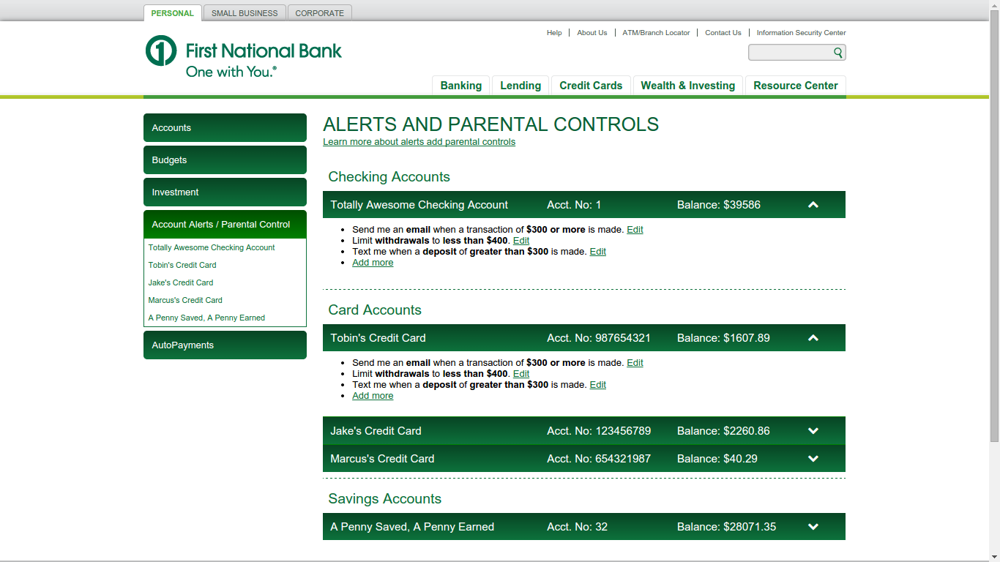
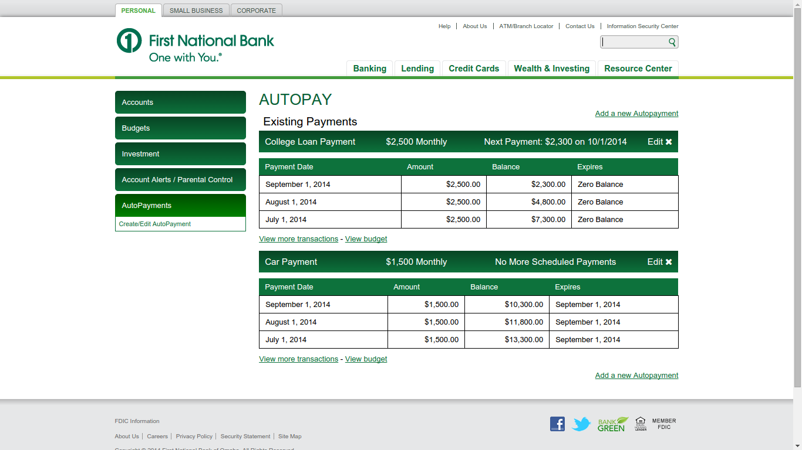

# Code One Omaha

(better) Raikes School team's repo for the Code One Omaha Hackathon

Team 9: Tobin Brown, Jake Sanchez, Marcus Pasell

## Screenshots

#### Accounts Menu

#### Transactions View

#### Budgets View

#### Investments Menu

#### Alerts Menu

#### Autopay Menu

## To get this running

- install virtualbox and vagrant
- add laravel homestead box
- get composer and update
- install dependencies
- run migrations
- run seeders
- compile sass

#### Virtualbox and Vagrant

[Virtualbox](https://www.virtualbox.org/wiki/Downloads) and [vagrant](https://www.vagrantup.com/downloads.html) make setting up a local development environment easy. Install both of these on your machine and move on to the next step.

#### Adding laravel homestead

Once you have Virtualbox and Vagrant installed you need to add the homestead box. Do this by running the following command in your command line / terminal.

`vagrant box add laravel/homestead`

Once the box downloads, you need to set up homestead using the instructions found in the laravel documentation

http://laravel.com/docs/homestead

Clone this repository to your computer and make sure you map the folder in the homestead.yaml file

#### Get composer and update

After the box is installed and homestead is configured, navigate to the directory where you cloned the homestead repo and run `vagrant up`.

Now your vm is running on localhost on port 8000 (or whatever you set it to). Now run `vagrant ssh`. To remote into your folder. Once in the code-one directory, you will need to download composer and run a composer update.

`curl -sS https://getcomposer.org/installer | php`

`php composer.phar update`

This will download the laravel framework and other php dependencies.

#### Install dependencies

We have a few more dependencies for compiling sass etc. that you will need to get (ruby gems, require ruby to be installed)

- compass
- sass
- bourbon
- neat
- font-awesome-sass

Install these with `gem install {gem-name}`

#### Run migrations

Now we need to run migrations to create our database tables. SSH into your box, navigate to the code-one folder and run the following

`php artisan migrate`

#### Run seeders

Now to populate the database with test data, run the following

`php artisan db:seed`

#### Compile SASS

The last thing we need to do is compile the sass. Navigation to code-one/app/public/res and run the following

`compass compile`

### YAY we're done!
